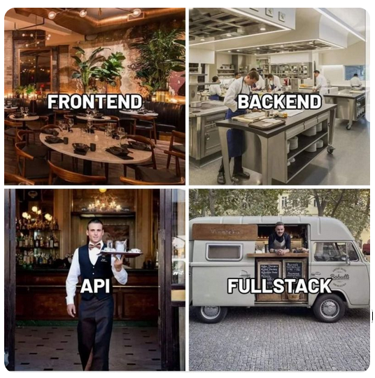
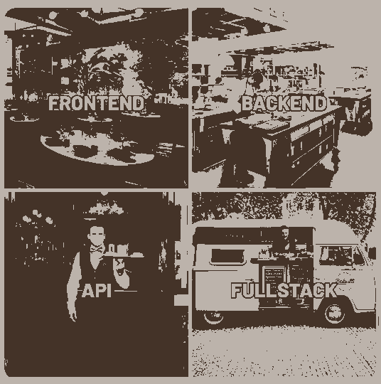
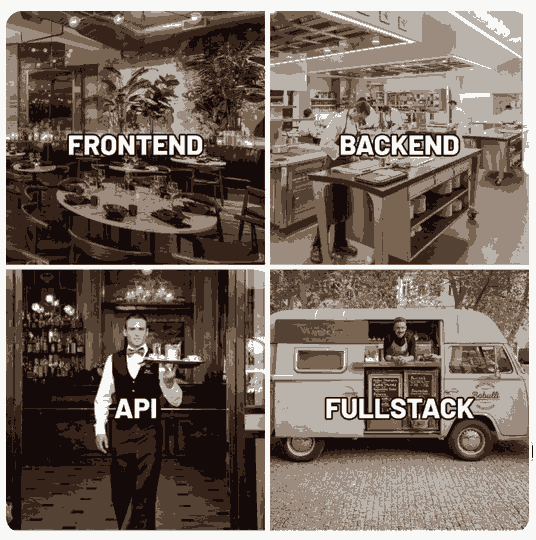

# imageCompressor

 

 

__ImageCompressor__ in __Haskell__ based on __K-Means algorithm__.

__compressor.py__ in __Python__ to transfrom png/jpg files in the ImageCompressor format.

__App.js__ in __JavaScript__ for the graphical interface.

## Description:

In this repository, you can find 3 ways of using the ImageCompressor. With a graphical interface made with react.js. With a python script to use in terminal. As at Epitech, with the haskell project and ___pixel files___ (testInput) in terminal.

__Choose your way, find the doc in *Usage*__

### K-Means Algorithm:

The k-means algorithm is a clustering technique that partitions data points (in this case, image pixels) into a specified number of groups, or _k clusters_. When applied to image compression, each pixel is treated as a point in a color space (typically RGB). The steps of the algorithm are as follows:

- __Initialization__: Randomly select k points from the image to initialize cluster centers (called centroids).

- __Assignment__: For each pixel, assign it to the cluster whose centroid is closest, based on a distance metric (usually Euclidean distance in RGB space).

- __Update Centroids__: Recalculate each centroid as the mean of all pixels assigned to its cluster.

- __Repeat__: Iterate the assignment and update steps until the centroids stabilize (i.e., they no longer change significantly).

After the algorithm converges, each pixel in the image is replaced by the color of its cluster’s centroid, reducing the total number of colors used while preserving the image’s overall structure.

This process reduces the image's file size by limiting the amount of color information that needs to be stored.

## Usage:

After cloning the repository, you can use the haskell imageCompressor by different ways:
- One with a graphical interface, made with `react.js`.
- One in terminal with a python script to give a `.png` or `.jpg` file and output a new compressed image.
- One in terminal, in the Epitech way, you give a ppm file and it will order the pixels by using the k-means algorithm.

__It's the same haskell program for all of them.__

With graphical website

 

If it's not already made:  ` chmod +x script.sh `

It will build the stack project and use the Makefile. It will also check the npm installation.

The script will start a server on port 5000 and start the react web site on port 3000: ` ./script.sh `

You will normaly be redirected in website on port 3000. If not, go on it by hand.` http://localhost:3000 `

There you can browse a `.png` or `.jpg` file and play with the cursors. The number of clusters is the number of colors you will have on your compressed picture. The degree is the intensity of the colors research.

With python

 

If it's not already made:   `chmod +x compressor.py `

If it's not already install : ` pip install Pillow` (useful library for the transfer of pixels in a picture)

usage:  `./compress.py yourImage.[jpg/png/bmp] nbClusters convLimit [output_path]`

Haskell only

 

If the project is not built correctly,  `stack build` and `Make`

__Or `cd ../web`  and `./script.sh` if you're lazy.__

Then, `cp imageCompressor ../HaskellOnly`. 

Usage:
`./imageCompressor -n <nbClusters> -l <convLimit> -f <yourFile>`

If you don't want to modify your input file:

`./imageCompressor -n <nbClusters> -l <convLimit> -f <yourFile> >> ouput` 

## Exemple:
 | Original Image | parameters | Compressed Image |
 | --- | --- | --- | 
 |  | -n 12 -l 0.45  |  |
 |  | -n 7 -l 0.95  |   |
 |  | -n 8 -l 0.45  |   |
 |  | -n 2 -l 0.5  |   |
 |  | -n 2 -l 0.5  |   |
 |  | -n 7 -l 0.2  |   |
 |  | -n 5 -l 0.8   |  |
 |  | -n 12 -l 0.4  |  |
 |  | -n 3 -l 0.04  |  |
 